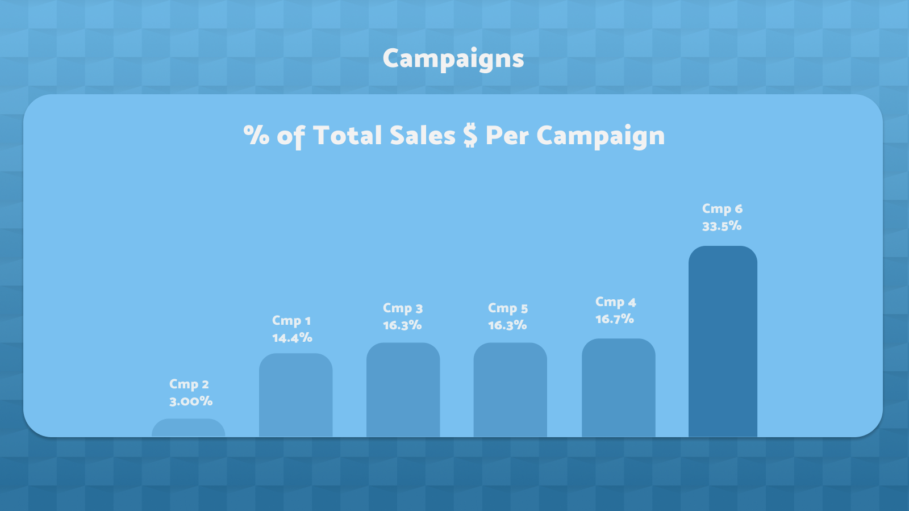
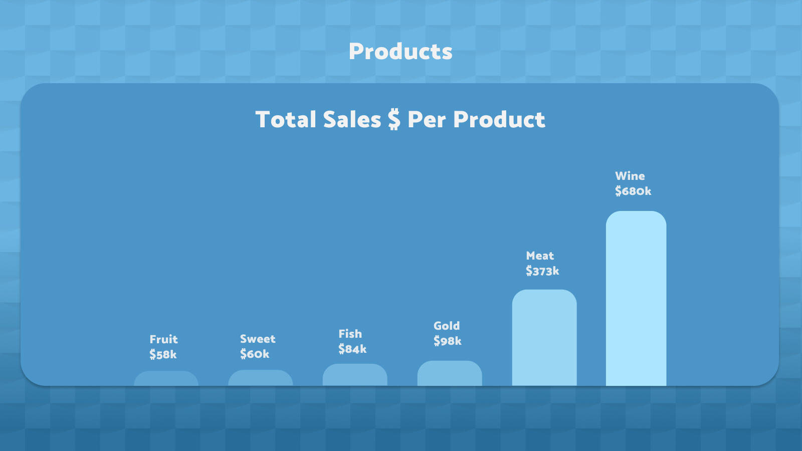
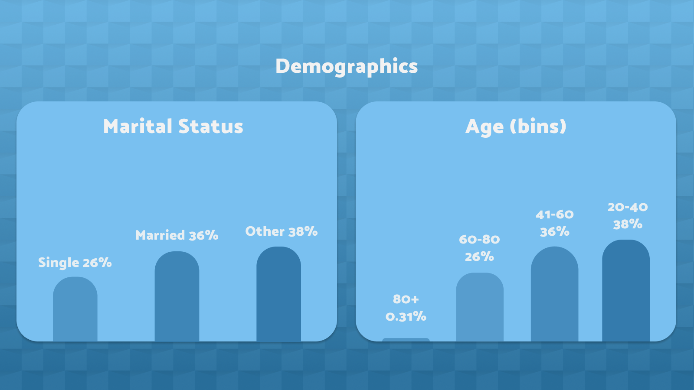
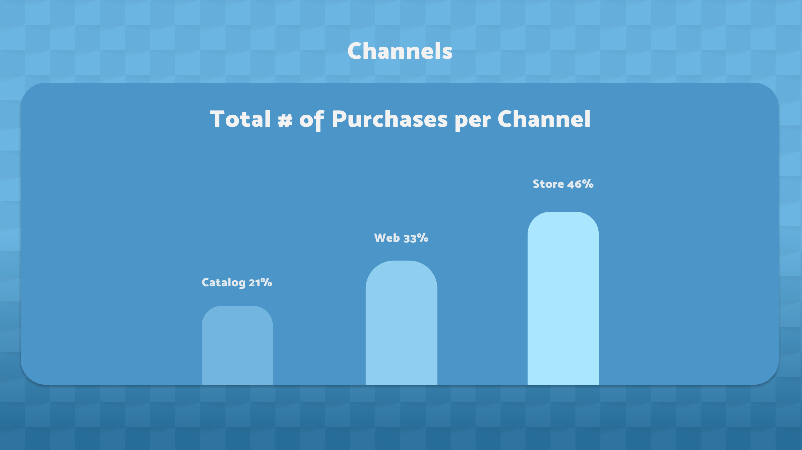
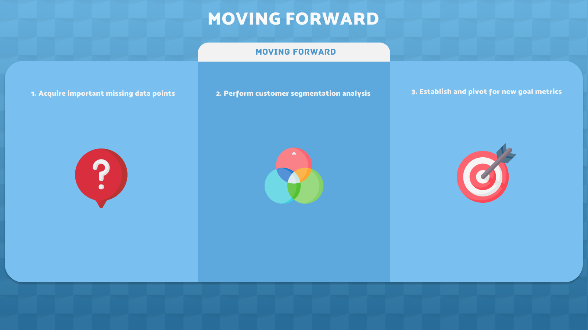

### Hey! I'm Andrew. Welcome to my [Github] 👋

- 📊 Data visualization is my forte. See my [Tableau] page! 
- 🚀 Most of what you see here is Tableau, Python, and Figma
- 🧠 I'm interested in how our social climate and media trends influence BI strategy
- ⛳ A nice quote: "If it's worth doing, it's worth doing well"

## XYZ Marketing Campaign Correlation Matrix

 

 
This readme includes various screenshots, but you can view the interactive dashboard [here].
 
The dataset was taken from Kaggle, thanks to user [JackDaoud]:
>**The is a CSV file of 2240 observations (customers) with 28 variables related to marketing data.** 
>More specifically, the variables provide insights about:
>
>- Customer profiles
>- Products purchased
>- Campaign success (or failure)
>- Channel performance

## Approach

All in all, these are the dataframes we need to create in Python

| Dataframe | Description |
| :----------- | :----------- |
| productsdf | Sum of numerical values, intended for simple Tableau bar chart |
| shopdf | Not formatted for Tableau, is used to create shopmatrixdf |
| shopmatrixdf | shopdf with .melt applied, is properly formatted for corr. matrix in Tableau |

1. We know that we'll want to use this data to create a correlation matrix in Tableau. But first, we need to clean and restructure our data. We started by importing the dataset and calling it **'shopdf'**.
2. **Cleaning** is very straightforward in this project. First, we take inventory of our dataset and look over our datatypes. We strip whitespace where necessary, convert Income values to float, and convert Dt_customer to datetime. Additionally, we use Birthdate to create a brand new Age column with a simple difference calculation.
3. **Restructuring** includes renaming and rearranging columns, creating **'productsdf'**, and recategorizing Marital Status values (see *Data Insights -> Demographics* for more info).
4. We then visualize our data with a Seaborn heatmap to get an idea of how it should look in Tableau.
5. In order to create a many-to-many correlation matrix with our cleaned data (**'shopdf'**), we would need to use multiple pivots in Tableau to restructure our columns. Tableau only allows for a single pivot, so instead, we opt to use the .melt function while we're still in Python to create a new, Tableau-friendly dataframe: **'shopmatrixdf'** 
6. Once our three dataframes were exported, Tableau and Figma were used in tandem to create the complete [dashboard]. 

## Data Insights
**Insights were mainly driven by the correlation matrix [dashboard], but I've included graphics of bar charts here to aid with impact and context** 

 
**Each campaign has its own strengths and weaknesses** 
- Campaigns 1 and 5
    - Strong inverse correlation with website views 
    - TOF: Keep submission forms local to Facebook/Instagram/etc.
    - BOF: Capture leads, opt for email marketing for conversions
     
- Campaign 3 
    - Related to increase of web visits, but not web sales (TOF, eval with CPM)
 
- Campaign 4 
    - More likely to convert via web (BOF, eval with CPC)
 
- Campaign 6 
    - Responsible for most of our sales conversions by a margin of 200%. But for a few different reasons, the conclusions we can draw from this knowledge are limited by the depth of our dataset. We're now encouraged to ask new questions:
    - What were the types of each campaign? If 6 was our only sales conversion campaign, and others were lead gen or engagement campaigns, then our limited breadth of metrics are apples and oranges.
    - When did these campaigns start and end? Use this information to filter sales metrics by concurrent campaign response data.
 

 
**Come for the wine, stay for everything else** 
- Wine sales are greater than the sales of all other categories combined
- Sales of all product types were less likely among customers with children
    - Incentivize spending for these customers
    - Are they more/less likely to be interested in customer rewards programs?
- Basket size is an important metric that we don’t have
    - Large basket sizes may compensate for less frequent visits (*see: channels -> website visits*)
     

 
**What about the children? Less is more** 
- Strong inverse correlation between children at home and most KPIs
    - All types of product sales and most campaign responses
    - Customers with no children are preferable
    - Perform a segmented analysis with more specific data
    - Calculate and compare CLV/CAC per customer segment

- Marital Status 
    - The importance of marital status as a metric is its pertinence to detailed targeting in FB/IG ads 
    - We can target a few different types of relationship statuses, however our dataset includes some undesirable/ambiguous values:

    >      
    > - Married
    > - Single
    > - Together
    > - Divorced
    > - Widowed
    > - Alone
    > - Absurd
    > - Yolo

    - There is no documentation to elaborate on the meaning of these values. 
    - While some remote inferences can be made, they were grouped into a collective Other category for the sake of consistency.
     

 
**Diversify online presence; gain performance insights**
- Younger customers with lower incomes are more likely to purchase online and use discounts
    - Correlation supports the sample’s receptiveness to discounts
- Sparse web visits may be linked to low email list open rates
    - Solve with a value-add: Include promo codes with marketing emails
- Encourage activity across multiple channels
- Web traffic may be a weak point and may require improvement
 
## Looking Back

This analysis gave us plenty of insight into our dataset and the campaigns that our company has been running. Now that we've created this correlation matrix and broken down our findings, our next step is to think about what's still missing from our analysis, and what we'll need before we make some concrete decisions.

It would be beneficial to follow up this project with a more in-depth examination of our campaigns via co-occurrence, but this would require an entirely different dataset than what we have now. While we do have customer data, we're still missing the element of time, which would give us information necessary to deduce exactly how successful each campaign was. In other words, we don't know what profits were made during the runnings of each campaign. Right now, we only know whether a customer has or hasn't responded to a campaign, and how much of a certain product that customer purchased. Basing decisions off of just this data would be jumping to conclusions too soon.

This is just scratching the surface. The graphic below details what needs to be done to move forward with our analysis.

## Moving Forward
 

 
1. Acquire important missing data points
    - Web Performance
        - Open Rates
        - Basket Size
    - Campaign Data
        - Type (engagement, lead gen, etc.)
        - Placements
        - Dates active
    - CLV/CAC
        - Profit margin
        - Number of purchases
2. Perform customer segmentation analysis
    - Demographics
        - Number of children
        - Age bins
    - Channels
        - Store vs web
        - Is the catalog profitable?
    - Financial contribution
        - Compare CAC
3. Establish and pivot for new goal metrics
    - Campaigns
        - CPM/CPC (depending on campaign type)
        - ROAS
        - CLV/CAC
    - North Star Metric?
        - CLV?
        - Value of daily purchases?
    - Set next-quarter benchmarks
## See the complete interactive dashboard [here]

[Tableau]: https://public.tableau.com/app/profile/andrew.bruening
[Github]: https://github.com/andrewbruening
[here]: https://public.tableau.com/views/MarketingCampaignCorrelationMatrix/Dashboard1?:language=en-US&:display_count=n&:origin=viz_share_link
[dashboard]: https://public.tableau.com/views/MarketingCampaignCorrelationMatrix/Dashboard1?:language=en-US&:display_count=n&:origin=viz_share_link
[JackDaoud]: https://www.kaggle.com/jackdaoud/marketing-data
