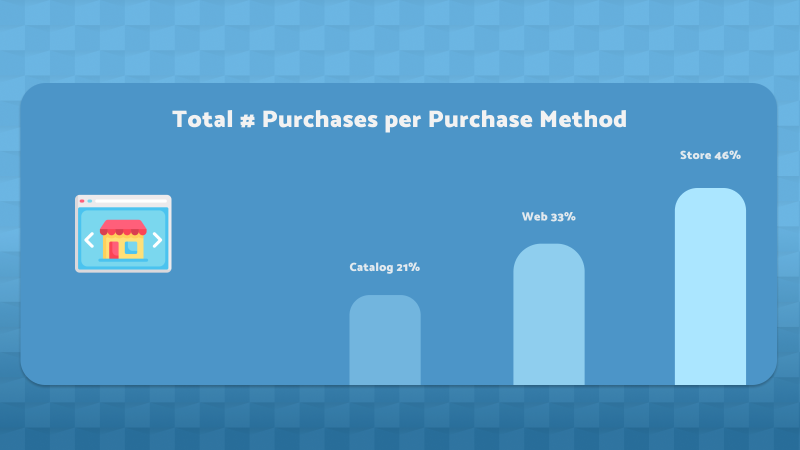

### Hey! I'm Andrew. Welcome to my [Github] 👋

- 📊 Data visualization is my forte. See my [Tableau] page! 
- 🚀 Most of what you see here is Tableau, Python, and Figma
- 🧠 I'm interested in how our social climate and media trends influence marketing needs
- ⛳ A nice quote: "If it's worth doing, it's worth doing well"

## XYZ Marketing Campaign Correlation Matrix
**AdventureWorks is a Microsoft product sample for an online transaction processing (OLTP) [database].**
 

 
This readme includes various screenshots, but you can view the actual dashboard [here]

## Approach
1. The pyodbc package was used to connect to the AdventureWorks database and query in python. 
2. Since we'll be importing our data to Tableau, it's in our best interests to work from one large dataframe. This isn't always possible, but we can take advantage of the opportunity here with **'custdf'**
3. There wasn't much cleaning to be done, but I did need to convert the **BirthDate** column to a brand new **Age** column. I wrote a custom function and used the difference between today's date and BirthDate to make Age.
4. A few dashboard elements were designed in Figma, then everything was imported to Tableau for dashboard creation. 
5. The complete [dashboard] features hover tooltips on most graphics and text boxes.

## Data Insights
 

 
**Demographics:** Our analysis points to a predominantly family-focused, upper middle class population who are likely to have multiple children and live in the Pacific Northwest. Genders are equally represented, slightly favoring married couples, and strongly favoring a college education.
 

 
**Location:** Destination-specific content can be A/B tested on the creative level.

    1. Imagery featuring recognizable locations may pique the interest of top-of-funnel colder customers (Crissy Field, Mount Rainier, etc.)

    2. PNW cities like San Francisco, Portland, and Vancouver are known to be well-traveled by commuters riding bikes to-and-from work, which surely makes up a considerable portion of Road Bike and Touring Bike purchases.

    3. The Seattle to Portland (STP) Bicycle Classic is one of the largest recreational bike rides in the country. Each year, thousands of riders participate in this multi-day event. With 77% of our customers in the PNW, the STP poses a potential partnership opportunity, or at the very least, viable inspiration for advertisements.
     

 
**Age:** The age range of 40-65 is particularly responsive to Facebook Ads but is most likely not using TikTok or Instagram. In order to target this population properly via Facebook:

    1. Create 1-2% lookalike audiences via Facebook Ads from an email list, or from the followers of competitors like REI, MEC, and Cannondale. 

    2. These audiences should match at least 1000 people in the market, and be combined with detailed targeting on the ad set level for use in Messages or Lead Generation campaigns.

    3. A/B test on the creative level with casual family-oriented biking imagery and copy. 

    4. These will be top-of-funnel campaigns, so cost will be measured based on CPM.
     

 
**Campaign Type:**
Campaign 6 was responsible for most of our sales conversions by a margin of 200%. But for a few different reasons, the conclusions we can draw from this knowledge are limited by the depth of our dataset. We're now encouraged to ask new questions:

• What were the types of each campaign? If 6 was our only sales conversion campaign, and others were lead gen or engagement campaigns, then our limited breadth of metrics are apples and oranges.

• When did these campaigns start and end? Use this information to filter sales metrics by concurrent campaign response data.
 

 
**Marital Status:** The importance of marital status as a metric is its pertinence to detailed targeting in FB/IG ads. We can target a few different types of relationship statuses, however our dataset includes some undesirable/ambiguous values.

In addition to Married and Single, we have:

• Together
• Divorced
• Widowed
• Alone
• Absurd
• Yolo

There is no documentation to elaborate on the meaning of these values. While some remote inferences can be made, they were grouped into a collective Other category for the sake of consistency.

## In Hindsight

This was an earlier project of mine. If I were to approach this project with the experience that I have now, the main difference I'd make in my actions is with the dashboard design. There are a number of ways I could go about making it more intuitive, organized, and aesthetically pleasing. For example, it would be beneficial to add separate dashboard pages or show/hide buttons to reduce clutter. This is a lot of information to squeeze into a 1600x900px space.

I've noticed that the most successful dashboards are the easiest to digest. Overall, I enjoy the monochrome color palette and the variety of graphs/charts that I included.  Marketing/BI analysts should have no problems using my dashboard. But looking back, I've realized that I've gained plenty of experience since working on this. It's been a refreshing way to take note of what I should do differently next time around.

I may revisit this in the future! If I do, I'll include before and after images.

## See the complete interactive dashboard [here]

[Tableau]: https://public.tableau.com/app/profile/andrew.bruening
[Github]: https://github.com/andrewbruening
[here]: https://public.tableau.com/views/MarketingCampaignCorrelationMatrix/Dashboard1?:language=en-US&:display_count=n&:origin=viz_share_link
[dashboard]: https://public.tableau.com/views/MarketingCampaignCorrelationMatrix/Dashboard1?:language=en-US&:display_count=n&:origin=viz_share_link
[Kaggle]: https://www.kaggle.com/jackdaoud/marketing-data
